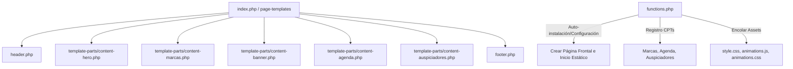

# 02_SDD.md — Diseño del Sistema

## 1. Arquitectura del Tema WordPress
El tema se construirá utilizando la arquitectura estándar de temas de WordPress (ficheros clásicos), optimizada para el renderizado rápido de una Single Page Application/Landing Page autogestionada.

## 2. Componentes y Flujo de Datos
- **Customizer (Personalizador nativo):** Manejará variables globales del sitio (textos del Hero, estadísticas, información del banner de Ingreso Libre, redes sociales del footer).
- **Custom Post Types (CPT):**
  - `marca`: Cada expositora tendrá su foto destacada, nombre, categoría (taxonomía) y enlace a Instagram.
  - `evento_agenda`: Eventos de la agenda. Tendrán fecha (día), hora, tag, foto destacada y título.
  - `auspiciador`: Auspiciadores con su logo (imagen destacada) y nombre.
- **Auto-Configuración:** Al activar el tema, `functions.php` ejecutará código para crear la página de inicio, asignarla en la configuración de lectura, y crear y asociar el menú si no existen.
